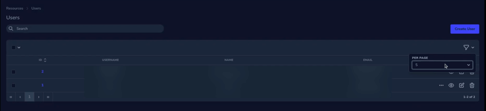

# How to add "Show All" option to per page in resource - laravel nova 4

---



---

## Versions:
* php >=8.1
* laravel >=9.19
* laravel/nova >= 4.19

---

## Steps:
1. Add `Show All` label: 
   * `nova/resources/js/components/FilterMenu.vue`:
       ```javascript
           perPageOptionsForFilter() {
               return map(this.perPageOptions, option => {
                   return {value: option, label: parseInt(option) === -1 ? Nova.translate('All') : option}
               })
           },
       ```

2. Fix pages in pagination:
   * `nova/resources/js/mixins/IndexConcerns.js`:
       ```javascript
           totalPages() {
               return parseInt(this.currentPerPage) === -1 ? 1 : Math.ceil(this.allMatchingResourceCount / this.currentPerPage)
           },
       ```

3. Fix pagination query:
   * `nova/src/Http/Requests/ResourceIndexRequest.php`:
       ```php
           public function searchIndex()
           {
               /** @var \App\Nova\Resource $resource */
               $resource = $this->resource();
        
               $result = app()->make(QueryBuilder::class, [ $resource ])->search(
                   $this,
                   $this->newQuery(),
                   $this->search,
                   $this->filters()->all(),
                   $this->orderings(),
                   $this->trashed()
               );
               $count = $this->toCount();
               $count = $count ?: -1;
               $perPage = (int) $this->perPage();
               $perPage = $perPage < 1 ? null : $perPage;
               $perPage = $perPage ?: $count;
    
               return $result->paginate($perPage);
           }
       ```

4. Fix `perPage` value:
   * `nova/src/Http/Requests/ResourceIndexRequest.php`:
       ```php
           public function perPage()
           {
               $resource = $this->resource();
        
               if( $this->viaRelationship() ) {
                   return (int) $resource::$perPageViaRelationship;
               }
        
               $perPageOptions = $resource::perPageOptions();
        
               if( empty($perPageOptions) ) {
                   $perPageOptions = [ $resource::newModel()->getPerPage() ];
               }
        
               $recCount = $this->toCount();
               if( intval($this->perPage) === -1 ) {
                   $recCount = $recCount === 0 ? -1 : $recCount;
               }
        
               return (int) intval($this->perPage) === $recCount || in_array($this->perPage, $perPageOptions) ? $this->perPage : $perPageOptions[ 0 ];
           }
       ```

4. Fix `toArray` for ajax:
   * `nova/src/Http/Resources/IndexViewResource.php`:
       ```php
           public function toArray($request)
           {
               $resource = $this->authorizedResourceForRequest($request);
        
               [ $paginator, $total, $sortable ] = $request->searchIndex();
               $perPage = $paginator->perPage();
               $perPageOptions = $resource::perPageOptions();
               $perPage = in_array(intval($perPage), $perPageOptions) ? $perPage : -1;
        
               return [
                   'label' => $resource::label(),
                   'resources' => $paginator->getCollection()->mapInto($resource)->map->serializeForIndex($request),
                   'prev_page_url' => $paginator->previousPageUrl(),
                   'next_page_url' => $paginator->nextPageUrl(),
                   'per_page' => $perPage,
                   'per_page_options' => $perPageOptions,
                   'total' => $total,
                   'softDeletes' => $resource::softDeletes(),
                   'polling' => $resource::$polling,
                   'pollingInterval' => $resource::$pollingInterval * 1000,
                   'showPollingToggle' => $resource::$showPollingToggle,
                   'sortable' => $sortable ?? true,
               ];
           }
       ```

5. Fix `paginate` for Query Builder:
    * `nova/src/Query/Builder.php`:
        ```php
            public function paginate($perPage)
            {
                $queryBuilder = $this->applyQueryCallbacks($this->queryBuilder);
            
                if (! $queryBuilder instanceof ScoutBuilder) {
                    $countForPagination = $this->getCountForPagination();
                    $perPage = $perPage < 1 ? $countForPagination?:-1 : $perPage;
                    return [
                        $queryBuilder->simplePaginate($perPage),
                        $countForPagination,
                        true,
                    ];
                }
                /** @var \Illuminate\Pagination\LengthAwarePaginator $scoutPaginated */
                $scoutPaginated = $queryBuilder->paginate($perPage);
                $items = $scoutPaginated->items();
                $hasMorePages = ($scoutPaginated->perPage() * $scoutPaginated->currentPage()) < $scoutPaginated->total();
                return [
                    Container::getInstance()->makeWith(Paginator::class, [
                        'items' => $items,
                        'perPage' => $scoutPaginated->perPage(),
                        'currentPage' => $scoutPaginated->currentPage(),
                        'options' => $scoutPaginated->getOptions(),
                    ])->hasMorePagesWhen($hasMorePages),
                    $scoutPaginated->total(),
                    false,
                ];
            }
        ```

6. Add `-1` in `$perPageOptions` as show all trigger:
   * `nova/src/Resource.php`:
       ```php
           public static $perPageOptions = [ 25, 50, 100, -1 ];
       ```

7. Add translation:
   * `lang/vendor/nova/en.json`:
       ```json
           "All": "All",
       ```

8. Build nova and publish the assets.. enjoy!


## Credit:
* [mPhpMaster](https://github.com/mPhpMaster)